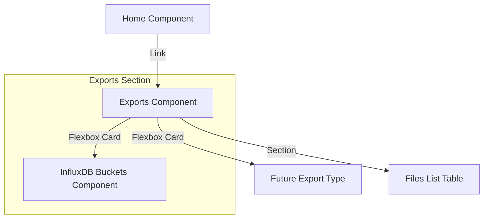

# Plan: Rename InfluxDB Buckets to Exports and Restructure

The goal is to transform the current InfluxDB buckets view into a broader "Exports" section. This involves renaming the component, creating a new landing page with a flexbox card layout, and setting up a scalable structure for future export types.

## Proposed Architecture

The `Exports` section will follow a parent-child routing structure:
- `/exports`: Landing page (`ExportsComponent`) showing cards for different export types AND the list of exported files.
- `/exports/influxdb`: The InfluxDB buckets management (`InfluxdbBucketsComponent`).

### Mermaid Diagram



## Proposed Changes

### 1. Renaming and Moving
- Rename `src/app/influxdb-buckets` to `src/app/exports`.
- Rename `influxdb-buckets.ts` to `influxdb-buckets.component.ts`.
- Rename class `InfluxdbBuckets` to `InfluxdbBucketsComponent`.

### 2. New Main Component
- Create `src/app/exports/exports.component.ts` (and HTML/CSS).
- This component will contain:
    - A flexbox layout with Material Cards linking to sub-exports.
    - The "Files" list (moved from the original component).

### 3. Routing
- Update `src/app/app.routes.ts`:
  ```typescript
  {
    path: 'exports',
    component: ExportsComponent,
    children: [
      { path: 'influxdb', component: InfluxdbBucketsComponent }
    ]
  }
  ```

### 4. UI Restructuring
- `ExportsComponent` will use `mat-card` for the export options.
- The "Files" table will be displayed below the cards on the main exports page.
